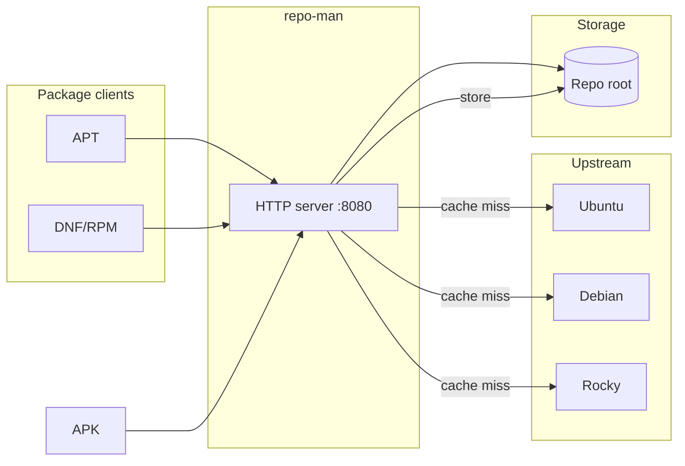
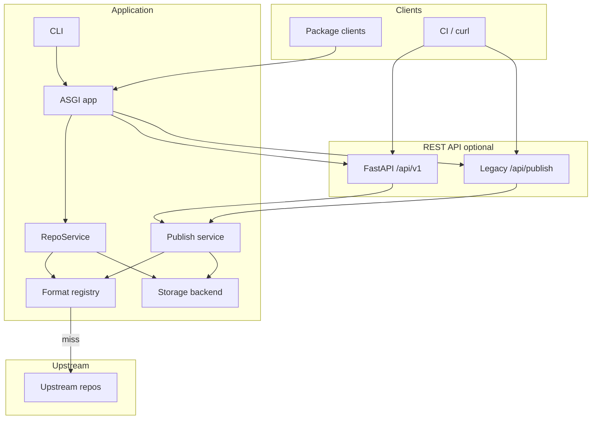
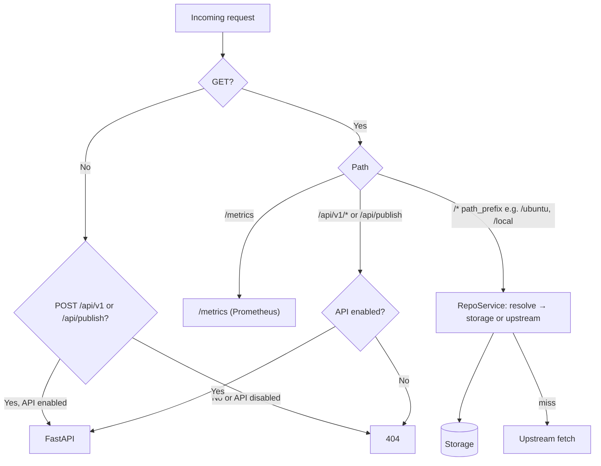
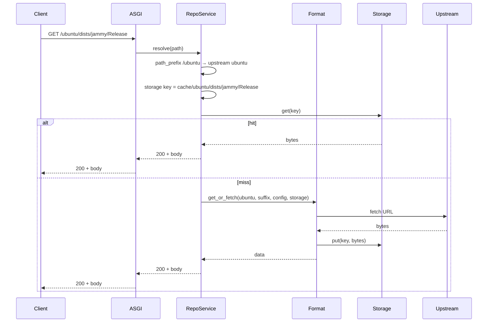
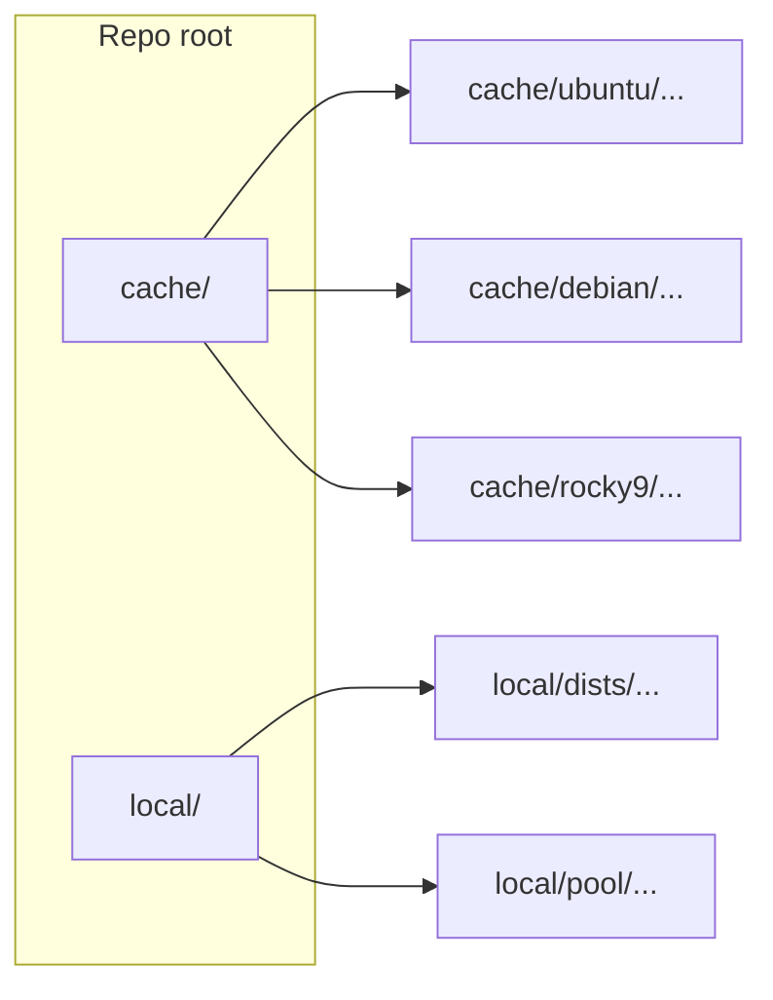
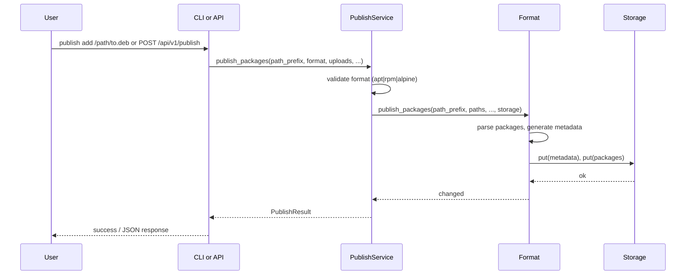

# Architecture

High-level architecture of **repo-man**: an extensible package repository manager with pluggable formats and storage. This document describes components, data flow, extension points, and includes diagrams of the application architecture.

---

## System context

Repo-man sits between **package clients** (APT, DNF, apk) and **upstream repositories**. It provides a single HTTP endpoint that serves both pull-through cached upstream content and locally published packages, plus optional REST API and Prometheus metrics.

- **Clients** use the repo-man URL with path prefixes (e.g. `http://host:8080/ubuntu`, `http://host:8080/local`).
- **Repo-man** serves repository files from storage; on cache miss it fetches from the matching upstream and stores the result.
- **Storage** holds both pull-through cache (`cache/<upstream_id>/`) and published repos (e.g. `local/`).

---

## Components

| Component | Description |
|-----------|-------------|
| **CLI** | Entry point `repo-man`. Commands: `serve`, `cache` (add-upstream, list, prune), `publish` (add, list), `config` (show, validate). Global options: `--config`, `--repo-root`, `--check`, `--output json`. |
| **ASGI app** | Single HTTP server (uvicorn). Routes **GET** requests: repo paths and `/metrics` go to RepoService; `/api/v1/*` and `POST /api/publish` go to FastAPI when the API is enabled. |
| **RepoService** | Core logic: resolve request path → storage key, serve from storage, on cache miss call format backend to fetch from upstream, optional TTL refresh and auto-prune. |
| **Format registry** | Returns the format backend (APT, RPM, Alpine) for a given format name; each backend knows how to fetch metadata/packages, publish, and prune. |
| **Publish service** | Shared publish logic used by CLI and API: validates input, dispatches to the correct format backend to ingest packages and write metadata. |
| **REST API** | **Off by default.** When enabled: **FastAPI** under `/api/v1` (e.g. `GET /api/v1/health`, `POST /api/v1/publish`) and legacy **`POST /api/publish`** (deprecated). No authentication—secure externally. |
| **Storage backend** | Interface (get, put, list_prefix, delete, exists). Default: local filesystem under repo root. Cache and published data all go through this abstraction. |

---

## Request routing

The ASGI app routes each request by path and method:

- **GET /metrics** → Prometheus text format from the default registry.
- **GET /api/v1/***, **POST /api/v1/***, **POST /api/publish** → FastAPI (only when API is enabled); otherwise 404.
- **GET /&lt;path_prefix&gt;/...** → RepoService resolves to a storage key (or upstream on miss), then serves from storage or fetches and caches.

---

## Data flow: client request (pull-through)

Request path is matched to a path prefix; the format backend resolves the storage key and, on cache miss, fetches from upstream. Example (APT):

---

## Storage layout

All data lives under the **repo root** (or bucket prefix). Keys are path-like; the first segment indicates cache vs local.

| Prefix | Meaning |
|--------|---------|
| `cache/<upstream_id>/` | Pull-through cache for that upstream (metadata and packages). |
| `<local_prefix>/` | Published repo; when API is enabled the default local prefix is `local`, so keys look like `local/dists/...`, `local/pool/...` (APT). |

Format backends define the exact structure under each prefix (e.g. APT: `dists/`, `pool/`).

---

## Publish flow

Publishing can be done via **CLI** or **REST API**. Both use the same **publish service**, which delegates to the format backend.

- **CLI**: `repo-man publish add --path-prefix /local/ ./pkg.deb`
- **API** (when enabled): `POST /api/v1/publish` (preferred) or `POST /api/publish` (legacy), multipart form with `path_prefix`, `format`, `packages`/`files`, and format-specific fields.

---

## Storage and format abstraction

- **Storage** — `repo_man/storage/base.py` defines `StorageBackend`. `LocalStorageBackend` in `storage/local.py` implements it. Keys are path-like (e.g. `cache/ubuntu/Release`, `local/dists/stable/Release`). Adding a new backend (e.g. S3) means implementing the interface and wiring it in config or a factory.
- **Format** — `repo_man/formats/base.py` defines `FormatBackend` (e.g. cache metadata fetch, get_or_fetch package, publish_packages, prune). Each format knows how to parse metadata, fetch/cache packages, publish, and prune. APT lives under `formats/apt/`; RPM under `formats/rpm/`; Alpine under `formats/alpine/`. Adding another format: implement the interface under `formats/<name>/` and register it.

---

## Config and repo root

- **Repo root** — Single root directory (or bucket prefix) for all storage. Env: `REPO_MIRROR_REPO_ROOT`; CLI: `--repo-root`.
- **Config file** — Optional YAML/TOML. Env: `REPO_MIRROR_CONFIG`. Contains `upstreams` (name, url, layout, path_prefix; format-specific fields such as suites/components/archs for APT). Default path when not set: `<repo_root>/config.yaml`.
- **Env** — `CACHE_VERSIONS_PER_PACKAGE`, `REPO_MIRROR_METADATA_TTL_SECONDS`, `REPO_MIRROR_ENABLE_API`, etc. See [operations.md](operations.md).
