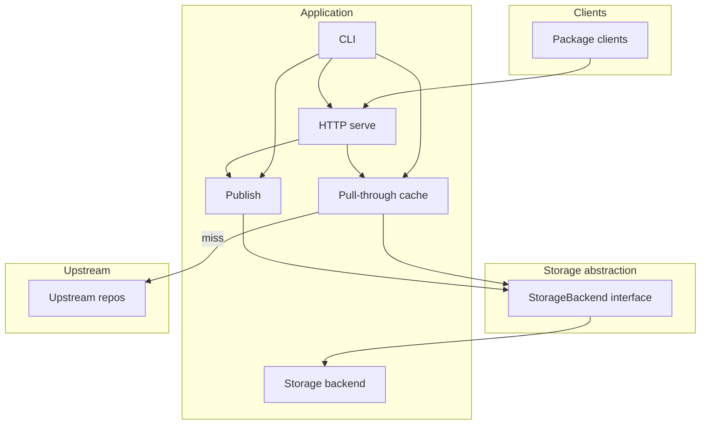
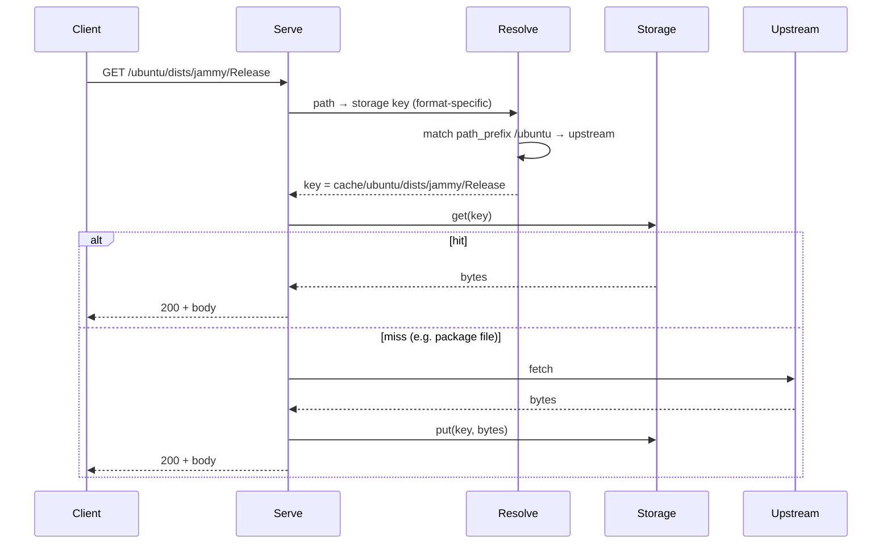

# Architecture

High-level architecture of repo-man: an extensible package repository manager with pluggable formats and storage. Components, data flow, and extension points.

## Components

- **CLI**: Entry point (`repo-man`). Commands: `serve`, `cache` (add-upstream, list, prune), `publish` (add, list), `config` (show, validate). Global options: `--config`, `--repo-root`, `--check`, `--output json`.
- **HTTP serve**: Serves repository files by path prefix (from storage) and `/metrics` (Prometheus). Request path is mapped to an upstream or local repo via config (path_prefix → cache/name or local prefix). Format-agnostic: each path prefix is handled by the configured format backend (e.g. APT).
- **Pull-through cache**: Per-upstream, per-format. Format metadata is kept fresh (short TTL or proxy). Packages are fetched from upstream on first request, stored under `cache/<upstream_id>/`, then served. Prune keeps latest N versions per package (versioning is format-specific).
- **Publish**: Ingest packages and generate format-specific metadata; store under a path prefix (local repo). The included APT format ingests .deb files and generates Packages/Release; other formats would follow the same pattern.
- **Storage abstraction**: Interface (get, put, list_prefix, delete, exists). Implementations: local filesystem first; S3-compatible or others via the same interface. All cache and publish data goes through it so backends are pluggable.

## Data flow (request path)

Request path is matched to a path prefix; the corresponding format backend resolves the storage key and (on cache miss) fetches from upstream. Example (APT):

## Storage and format abstraction layers

- **Storage**: `repo_man/storage/base.py` defines `StorageBackend`. `LocalStorageBackend` in `storage/local.py` implements it. Keys are path-like (e.g. `cache/ubuntu/Release`, `local/dists/stable/Release`). Adding a new backend (e.g. S3) means implementing the interface and registering it in config or a factory.
- **Format**: `repo_man/formats/base.py` defines `FormatBackend` (cache_fetch_metadata, cache_get_or_fetch_package, publish_packages, prune). Each format knows how to parse metadata, fetch/cache packages, publish, and prune. The included APT implementation lives under `formats/apt/`. Adding another format (e.g. RPM): implement the same interface under `formats/<name>/`.

## Config and repo root

- **Repo root**: Single root directory (or bucket prefix) for all storage. Env: `REPO_MIRROR_REPO_ROOT`; CLI: `--repo-root`.
- **Config file**: Optional YAML/TOML. Env: `REPO_MIRROR_CONFIG`. Contains `upstreams` (name, url, layout, path_prefix; format-specific fields such as suites/components/archs for APT). Default path when not set: `<repo_root>/config.yaml`.
- **Env**: `CACHE_VERSIONS_PER_PACKAGE`, `REPO_MIRROR_METADATA_TTL_SECONDS`, etc. See [operations.md](operations.md).
